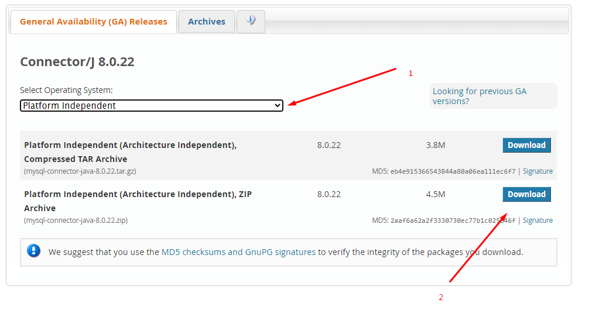
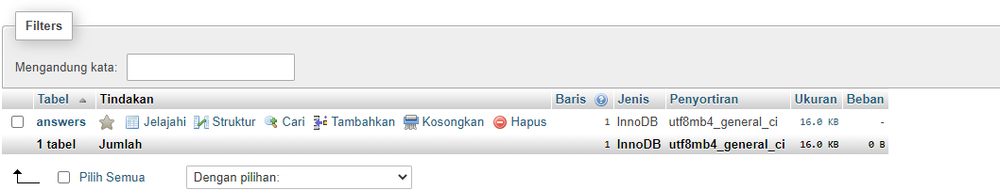
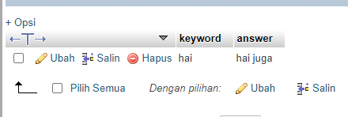
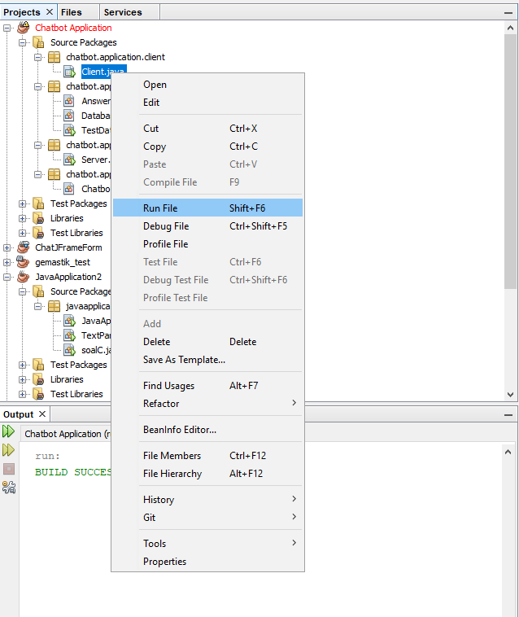
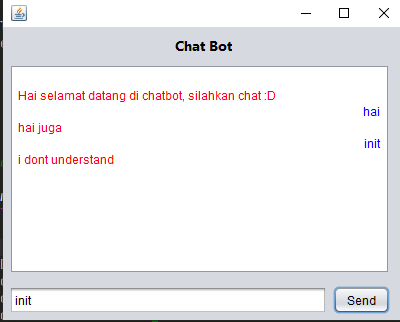

# pemjar-java-chat

create chat bot using Mysql as database and java ANT

dont forget to import driver from my sql on : https://dev.mysql.com/downloads/connector/j/

download:

>

   
# Run The app

database setting
>

coloumn on database
>

run the client directly 
>

   
# App

>

   
# Demo App

link : https://drive.google.com/file/d/1ikdAavJz2dG3Xmu05fMoXF1guqr9BC6K/view